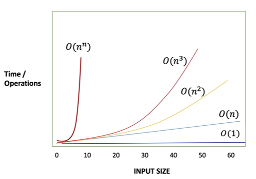

# DATA STRUCTURE


**Constant Time (Fastest algorithm)**

The fastest algorithm method it has single line of method on body like getElementFrom method it accept the array and position and return the element at given index position

```java
public int getElementFrom(int [] a, int index){
    return a[index]
}
```
Constant Growth Rate *O(1)*


**Linear**

-Single loop

Algorithms that iterate an entire list of things once are typically **Linear**,  so if the array we pass to method contains 10,000 elements, the loop would run 10,000 times. 

Linear Growth Rate *O(n)* 


**Nested Loop**

**Quadratic**

-Loop inside of Loop

```java 
for(..){
    for(...){
     ...   
    }
}
```

```java
public int countDuplicates(int items1[], int items2[]){
    int count = 0;
    for (int i = 0; i < items1.length; i++){
        for (int j = 0; j < items2.length; j++){
            if (items1[i] == items2 [j]) {
                count++;
            }
        }
    }
    return count;
}
```

The number of operations or iterations that will need to be run will be equal to the size of the input squared.

Quadratic Growth Rate *O(n²)*


**Cubic** 

```java 
for(..){
    for(...){
        for(...){
            ...   
        }   
    }
}
```
Cubic Growth Rate *O(n³)*

**Exponential** 

```java 
for(..){
    for(...){
        for(...){
            for(...){
                ... 
                    ...
                ...  
            }    
        }   
    }
}
```
Cubic Growth Rate *O(n <sup>n</sup> )*

## Asymptotic Notation (Big O Notation)



|Growth Rate|Notation|
|---|---|
|Constant Growth Rate|*O(1)*|
|Linear Growth Rate |*O(n)*|
|Quadratic Growth Rate|*O(n <sup>2</sup> )*|
|Cubic Growth Rate|*O(n <sup>3</sup> )*|
|Exponential Growth Rate|*O(n <sup>n</sup> )*|